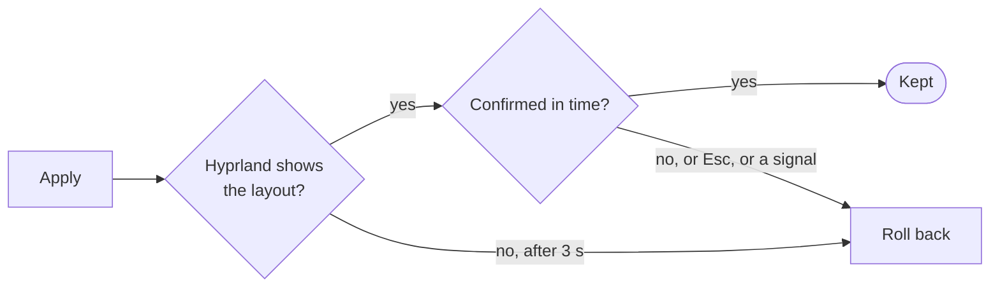

<!-- SPDX-License-Identifier: GPL-3.0-only -->
<!-- Copyright (C) 2026 Mateusz Okulanis <FPGArtktic@outlook.com> -->

# Applying and rollback

A wrong monitor layout can leave you without a usable screen. Every change
hyprtilt makes therefore goes the same way: apply, verify, confirm, and
roll back otherwise.



## Two ways to apply

**Live** (++a++ in the interface, `--live` for the per-output commands):
hyprtilt sends the rules to the running Hyprland: `hl.monitor(...)` through
`hyprctl eval` for a Lua configuration, `hyprctl keyword monitor ...` for
hyprlang. The file is not touched, and the next reload returns to it.
Rolling back sends the previous live state the same way.

**Write** (++w++, the per-output commands, `apply --profile`): hyprtilt
writes the managed block (after a backup and a syntax check) and reloads
Hyprland. Rolling back writes the previous content back and reloads again.

`hyprtilt apply` without a profile reloads the file as it is, for example
after you edited it by hand; rolling back restores the live layout from
before the reload.

## Verification

Hyprland answers a request before it has changed the monitors, so hyprtilt
polls the monitor list every 100 ms for up to 3 seconds and compares, for
every output it changed, the enabled state, resolution, refresh rate
(±1 Hz), position (±1 px), the scale Hyprland will really use and the
transform. If they do not match in time, the change is rolled back and the
differences are shown:

```text
hyprtilt: the change was rolled back: Hyprland does not show the expected layout: DP-1: refresh rate is 164.98 Hz, expected 144 Hz
```

## Confirmation

After a successful check, hyprtilt asks whether to keep the layout and
counts down, 15 seconds by default:

- In the interface: ++y++ or ++enter++ keeps it, ++n++ or ++esc++ reverts it.
- On the command line (`apply`): type `y` and ++enter++; anything else, the
  end of the input or the timeout reverts it.

`confirm_timeout` in [config.toml](configuration.md#settings) or
`--confirm-timeout` changes the time; 0 (or `--no-confirm`) keeps a
verified change without asking. The per-output commands never ask: they are
meant for keybindings, and a change Hyprland shows is kept.

A write of the layout Hyprland already runs is verified but not counted
down, since nothing on the screen changes.

## Signals

`SIGINT`, `SIGTERM` and, in the interface, `SIGHUP` during a pending change
roll it back before hyprtilt exits, so closing the terminal or pressing
++ctrl+c++ does not leave an unconfirmed layout behind.

## When the rollback fails

If restoring fails too (for example Hyprland stopped answering), hyprtilt
says what failed and exits with code 1. The backup of the file is still
there: `<file>.bak.<UTC time>`.
