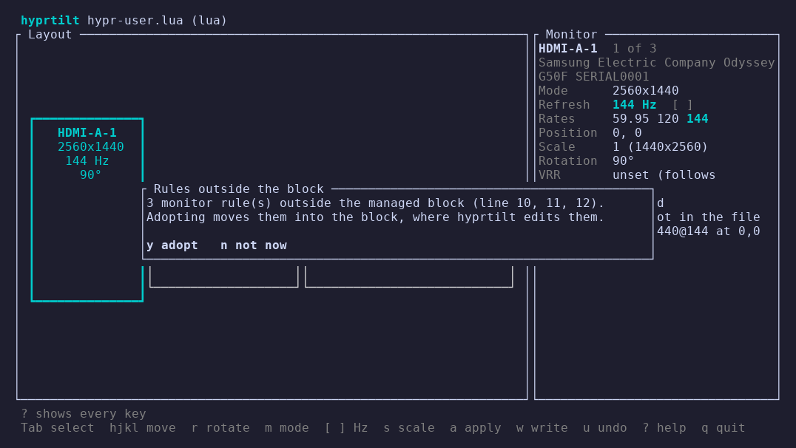

<!-- SPDX-License-Identifier: GPL-3.0-only -->
<!-- Copyright (C) 2026 Mateusz Okulanis <FPGArtktic@outlook.com> -->

# Quick start

## 1. Check the setup

```sh
hyprtilt doctor
```

`doctor` shows which file hyprtilt edits and why, whether Hyprland loads
that file, and which monitor rules would win over the ones hyprtilt writes.
Fix every `[warn]` and `[FAIL]` line before going on;
[Troubleshooting](doctor.md) explains each of them.

## 2. Look at the monitors

```console
$ hyprtilt list
File:  /home/you/.config/caelestia/hypr-user.lua (lua, Caelestia preset)
Block: none yet (`hyprtilt save` or `hyprtilt adopt` creates it)
Hyprland 0.56.2 (lua)

OUTPUT    STATE  MODE              POSITION   SCALE  TRANSFORM  RULE
HDMI-A-1  on     2560x1440@144     0x0        1      90°        none
eDP-1     on     1920x1080@144     1440x1335  1      0°         none
DP-1      on     2560x1440@179.95  3360x975   1      0°         none

3 rule(s) outside the block (line 5, 6, 7); `hyprtilt adopt` moves them in
```

## 3. Adopt the rules you already have

hyprtilt only edits the lines between its markers. `adopt` moves the rules
you wrote into a new managed block, keeping their text. The interface
offers the same when it starts:



On the command line:

```sh
hyprtilt adopt --dry-run   # shows the diff
hyprtilt adopt
```

```lua
-- BEGIN hyprtilt (managed)
hl.monitor({ output = "HDMI-A-1", mode = "2560x1440@144",    position = "0x0",       scale = 1, transform = 1 })
hl.monitor({ output = "eDP-1",    mode = "1920x1080@144",    position = "1440x1335", scale = 1 })
hl.monitor({ output = "DP-1",     mode = "2560x1440@179.95", position = "3360x975",  scale = 1, vrr = 2 })
-- END hyprtilt
```

Without rules to adopt, `hyprtilt save` writes the running layout into a new
block instead.

## 4. Arrange the monitors

```sh
hyprtilt
```

Select a monitor with ++tab++, move it with ++h++ ++j++ ++k++ ++l++, rotate
it with ++r++, change the refresh rate with ++bracket-left++ and
++bracket-right++. Press ++a++ to try the layout live or ++w++ to write it
into the file. Either way Hyprland shows the new layout and hyprtilt asks
whether to keep it: without ++y++ within 15 seconds the previous layout
comes back. [The terminal interface](tui.md) lists every key.

## 5. Script it

Every change is also a command, for keybindings and scripts:

```sh
hyprtilt rotate HDMI-A-1 90
hyprtilt refresh DP-1 max
hyprtilt move eDP-1 1440x1335
hyprtilt profile save desk
hyprtilt apply --profile desk
```

See [the command line](cli.md).
