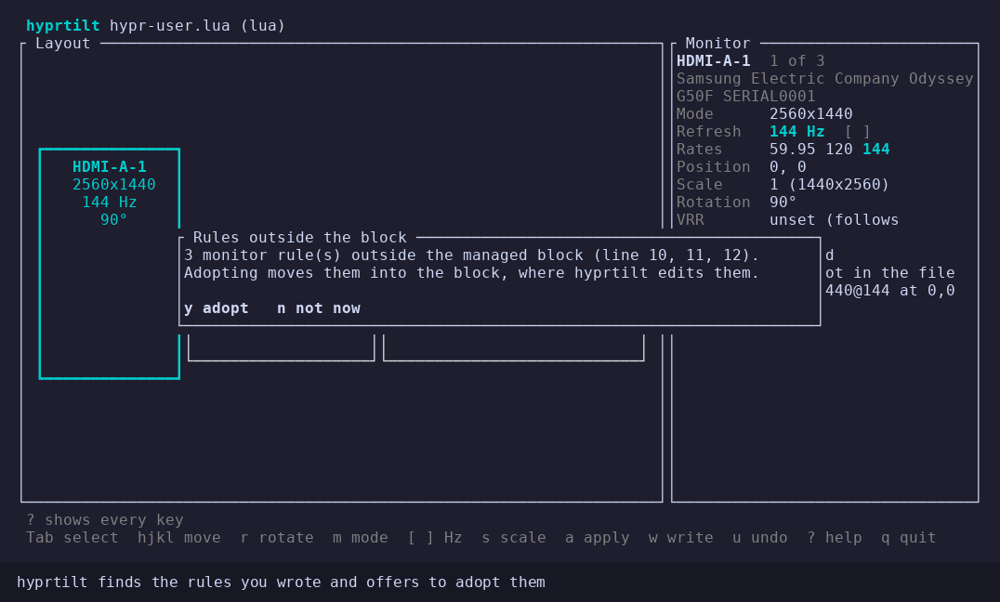
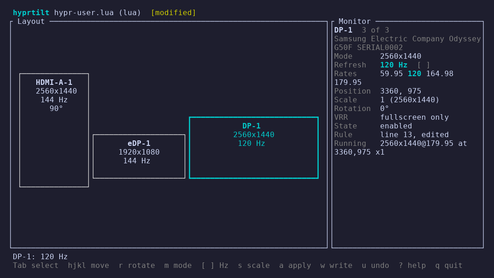
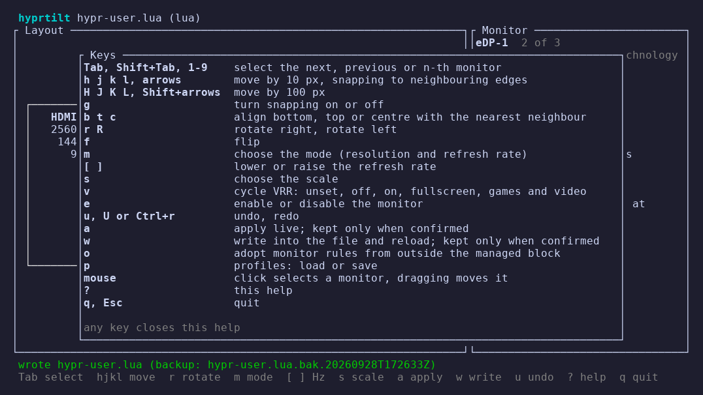
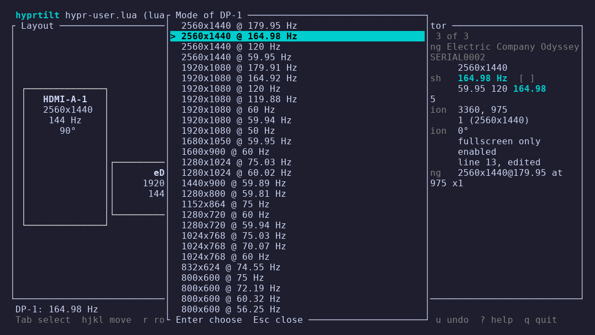
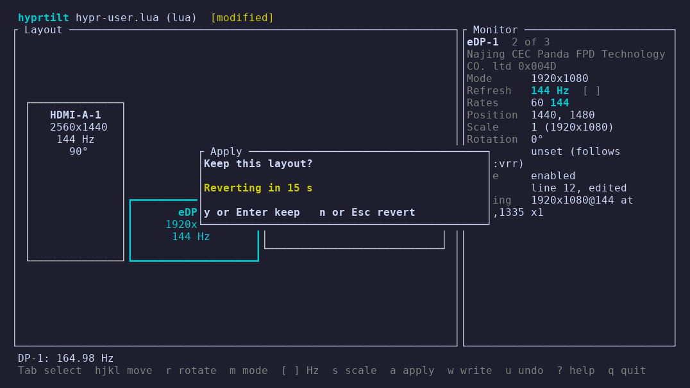

<!-- SPDX-License-Identifier: GPL-3.0-only -->
<!-- Copyright (C) 2026 Mateusz Okulanis <FPGArtktic@outlook.com> -->

# The terminal interface

`hyprtilt` without a subcommand opens the interface. It edits the rules of
the managed block and shows the result before anything reaches Hyprland.

- **Layout** draws the enabled monitors to scale in logical pixels, with
  their name, resolution, refresh rate, rotation and scale. The selected
  monitor has a thick border; overlapping monitors are red.
- **Monitor** shows the selected monitor: its mode, the refresh rate and
  every rate its current resolution offers, position, scale and the
  logical size it gives, rotation, VRR, whether it is enabled, the line of
  its rule in the file, and what Hyprland runs right now. Problems of the
  whole layout (overlaps, gaps the pointer cannot cross, scales Hyprland
  adjusts, modes the monitor does not list) follow below.
- The **title** shows the file and flags: `[modified]` when the layout
  differs from the file, `[live change not in the file]` after a live
  change you kept, `[offline]` without Hyprland.

Below 80 columns the monitor panel moves under the layout.

## Keys

| Keys | Action |
|---|---|
| ++tab++, ++shift+tab++, ++1++ … ++9++ | select the next, previous or n-th monitor |
| ++h++ ++j++ ++k++ ++l++, arrows | move by 10 px, or to the next edge of a neighbour within 100 px |
| ++shift+h++ ++shift+j++ ++shift+k++ ++shift+l++, ++shift++ + arrows | move by 100 px |
| ++g++ | turn snapping on or off |
| ++b++ ++t++ ++c++ | align the bottom, top or centre with the nearest neighbour |
| ++r++ ++shift+r++ | rotate right, rotate left |
| ++f++ | flip |
| ++m++ | choose the mode (resolution and refresh rate) |
| ++bracket-left++ ++bracket-right++ | lower or raise the refresh rate |
| ++s++ | choose the scale |
| ++v++ | cycle VRR: unset, off, on, fullscreen, games and video |
| ++e++ | enable or disable the monitor |
| ++u++, ++shift+u++ or ++ctrl+r++ | undo, redo |
| ++a++ | apply live; kept only when confirmed |
| ++w++ | write into the file and reload; kept only when confirmed |
| ++o++ | adopt monitor rules from outside the managed block |
| ++p++ | profiles: load or save |
| mouse | a click selects a monitor, dragging moves it on a 10 px grid |
| ++question++ | help |
| ++q++, ++esc++ | quit |

The same table is in the help popup (++question++):

### Moving and snapping

With snapping on, a move goes straight to the next edge of another monitor
when one is within 100 px in that direction, so monitors line up exactly;
otherwise it moves by 10 px (100 px with ++shift++).
Rotating or changing the mode or scale changes a monitor's logical size;
monitors to its right and below that touched it move with its edge, so
the layout stays connected.

### Refresh rate

++bracket-left++ and ++bracket-right++ step through the rates the monitor
offers for its current resolution, from the list Hyprland reports. The
status line names the new rate; at the lowest or highest rate it says so.
++m++ shows every mode, and `preferred`, `highrr` and `highres`.

### Scale

++s++ lists the scales between 0.5 and 3 that divide the resolution into
whole logical pixels, which Hyprland accepts without adjusting them, with
the logical size each gives, and `auto`.

## Applying and writing

++a++ sends the layout to the running Hyprland; ++w++ writes it into the file
(a backup first) and reloads. Both check that Hyprland shows what was
asked, then count down:

Without an answer the previous layout comes back, and for ++w++ the previous
file too. A write of the layout Hyprland already runs (for example right
after a kept ++a++) is only verified. Details in
[Applying and rollback](apply.md).

++a++ and ++w++ refuse overlapping monitors.

## Quitting

With unsaved changes ++q++ asks what to do: ++w++ writes and quits once the
write is kept, ++q++ quits without writing, and after a kept live change
++r++ reloads the file (dropping the live change) and quits. ++esc++ stays.

`SIGTERM`, `SIGHUP` and `SIGINT` roll back a change that is still counting
down, then quit.

## Hotplug

hyprtilt listens to Hyprland's event socket. When a monitor is connected
or disconnected, the layout is rebuilt and your edits are kept; rules
written for a monitor that is gone stay in the block. The undo history is
cleared, because it describes the old set of monitors.

## Without Hyprland

If Hyprland is not reachable, the layout comes from the rules of the block
that name a resolution. ++w++ still writes the file; nothing is applied or
verified.
