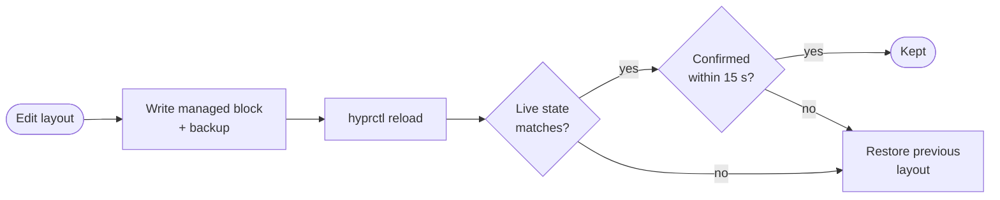

<!-- SPDX-License-Identifier: GPL-3.0-only -->
<!-- Copyright (C) 2026 Mateusz Okulanis <FPGArtktic@outlook.com> -->

<div class="ht-hero" markdown>

<span class="ht-pill"><span class="ht-dot"></span>Hyprland 0.55+ Lua &middot; hyprlang &middot; Caelestia</span>

# Arrange your monitors. <span class="ht-gradient-text">Keep your config.</span>

<p class="ht-lead">
hyprtilt is a keyboard-first terminal UI and CLI that edits the
<code>hl.monitor</code> rules in <em>your own</em> Hyprland file &mdash; in place,
inside a managed block, with everything else preserved byte for byte.
</p>

<div class="ht-actions" markdown>
[Read the roadmap](project/roadmap.md){ .md-button .md-button--primary }
[:fontawesome-brands-github: View on GitHub](https://github.com/FPGArtktic/hyprtilt){ .md-button }
</div>

<div class="ht-window" markdown>
<div class="ht-window__bar"><span></span><span></span><span></span><em>~/.config/caelestia/hypr-user.lua</em></div>

```lua
-- Your own settings stay exactly as they are.
hl.config({ input = { repeat_delay = 500, repeat_rate = 30 } })

-- BEGIN hyprtilt (managed)
hl.monitor({ output = "HDMI-A-1", mode = "2560x1440@144", position = "0x0", scale = 1, transform = 1 })
hl.monitor({ output = "eDP-1", mode = "1920x1080@144", position = "1440x1335", scale = 1 })
hl.monitor({ output = "DP-1", mode = "2560x1440@179.95", position = "3360x975", scale = 1, vrr = 2 })
-- END hyprtilt

return {} -- the block always goes before a top-level return
```

</div>
</div>

## Why hyprtilt { .ht-section-title }

<p class="ht-section-lead">
Other tools generate a file of their own and add an include to yours.
hyprtilt treats <strong>your configuration as the source of truth</strong>.
</p>

<div class="grid cards" markdown>

-   :material-file-document-edit-outline:{ .lg } __Config-file-first__

    ---

    Edits `hl.monitor` calls in the file you already use, inside a clearly
    marked block. No sidecar files, no include lines, no daemon.

-   :material-shield-check-outline:{ .lg } __Byte-for-byte safe__

    ---

    Everything outside the block is copied verbatim. Saving an unchanged
    layout writes nothing. Every write is backed up and syntax-checked.

-   :material-backup-restore:{ .lg } __Apply with rollback__

    ---

    Changes are verified against the live state over IPC. Without your
    confirmation, the previous layout comes back after 15 seconds.

-   :material-keyboard-outline:{ .lg } __Keyboard-first__

    ---

    `hjkl` to move, `r` to rotate, snapping and alignment shortcuts. Works in
    an 80&times;24 terminal; the mouse is optional.

-   :material-console-line:{ .lg } __Per-output CLI__

    ---

    `hyprtilt rotate HDMI-A-1 90` from a keybinding, plus `move`, `scale`,
    `mode`, `enable`, `disable`, with `--json` and `--dry-run`.

-   :material-palette-swatch-outline:{ .lg } __Caelestia aware__

    ---

    Targets `hypr-user.lua`, which Caelestia never overwrites, and knows that
    the block must precede its `return`.

-   :material-swap-horizontal:{ .lg } __Takes over existing rules__

    ---

    Finds `hl.monitor`, `monitor=` and `monitorv2` rules outside the block
    and offers to adopt them. `unmanage` gives them back.

-   :material-lightning-bolt-outline:{ .lg } __One static binary__

    ---

    Written in Rust, statically linked, no runtime. Packages for Arch Linux
    (AUR), Debian and Ubuntu, and RPM-based systems.

</div>

## How a change is applied { .ht-section-title }

<p class="ht-section-lead">
Every change goes through the same safe path, whether it comes from the TUI
or from a keybinding.
</p>



!!! info "Status"

    hyprtilt is under active development and has no release yet. The design
    decisions and the verified facts about Hyprland's Lua API are published
    as they are made; see the [roadmap](project/roadmap.md).
